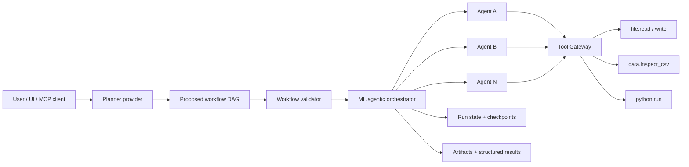

<div align="center">

# ML.agentic

### Agent-native orchestration for reproducible data-science workflows

**Plan with an LLM. Execute with deterministic controls. Keep the human in charge.**


</div>

---

## Overview

**ML.agentic** is an agent-native data-science workspace that separates **reasoning** from **execution control**.

A model may propose a workflow, but it does not own the runtime. ML.agentic validates the generated DAG, enforces dependencies and budgets, restricts tools, manages approvals, tracks run state and stores artifacts in isolated workspaces.

The goal is to make agentic workflows **inspectable, reproducible and controllable** instead of relying on an unrestricted autonomous shell.

### Why this project exists

Most agent frameworks are excellent at giving models more autonomy. ML.agentic explores the complementary problem:

> **How do we let agents work autonomously while keeping execution deterministic, bounded and observable?**

The project is designed around four principles:

- **Provider independence** — Codex, GitHub Copilot, Claude Code and Ollama are treated as interchangeable reasoning providers.
- **Deterministic control plane** — the runtime, not the model, owns dependencies, budgets, approvals and run state.
- **Restricted execution** — agents request named capabilities through a Tool Gateway rather than receiving unrestricted machine access.
- **Human control** — approval gates, pause/resume and explicit limits remain first-class concepts.

---

## Architecture



### Control flow

1. The user describes a business or data problem and selects a provider.
2. The provider proposes a workflow DAG.
3. ML.agentic validates dependencies, tool names, workflow shape and execution limits.
4. The scheduler releases only nodes whose dependencies are satisfied.
5. Each agent receives its role, dependency outputs, allowed tools and budget.
6. Tool requests pass through the Tool Gateway and the node allowlist.
7. Results are persisted and propagated to dependent agents.
8. Execution stops on completion, a human gate, a provider failure or a hard budget limit.

---

## Current capabilities

| Area | Capability |
|---|---|
| Orchestration | Dependency-aware DAG execution |
| Providers | Codex, GitHub Copilot, Claude Code, Ollama |
| Interfaces | CLI, MCP server, local web dashboard |
| Controls | Per-run token/model-turn limits, per-agent provider/model/tool policies |
| Human-in-the-loop | Approval gates and pause/resume between agents |
| Tooling | Workspace-scoped file I/O, CSV inspection and Python execution |
| State | Structured agent results, run summaries and web-run checkpoints |
| Isolation | Docker-backed Python execution in the web runner |
| Quality | Deterministic provider doubles and unit tests |

> **Project status:** working MVP. The architecture and control plane are functional, while production hardening, broader ingestion and stronger recovery semantics remain active work.

---

## Quick start

### Windows / PowerShell

Requirements:

- Python 3.11+
- Docker for isolated `python.run` execution
- At least one configured provider if you want real model execution

```powershell
.\start.cmd
```

The launcher creates `.venv`, installs the required web dependencies and opens the dashboard when the server is ready.

Update the current branch before starting:

```powershell
.\start.cmd --update
```

Useful options:

```powershell
.\start.cmd --port 8766
.\start.cmd --no-browser
```

### macOS / Linux

```bash
python3 start.py
```

---

## Install the runtime

```bash
python -m venv .venv
source .venv/bin/activate
pip install -e ".[runtime]"
python -m copilot download-runtime
```

Authenticate only the providers you want to expose to the runner:

```bash
codex login
claude auth login
```

Provider installation and authentication intentionally remain separate from ML.agentic.

---

## Run a CSV workflow

```bash
ml-agentic run \
  --data clients.csv \
  --problem "Predict 30-day churn and produce a report with model metrics" \
  --provider openai_codex
```

The planner receives the business objective, the dataset name and the exact Tool Gateway manifest. ML.agentic then:

1. creates an isolated run workspace;
2. copies the source dataset to `input.csv`;
3. validates the generated DAG;
4. executes eligible agents and tool calls;
5. writes a structured run summary.

Artifacts are stored under:

```text
.ml-agentic/runs/<run_id>/
```

The first data runner deliberately accepts CSV only while ingestion and artifact contracts are stabilized.

---

## MCP interface

Start the MCP server:

```bash
ml-agentic-mcp
```

Or use streamable HTTP:

```bash
mcp run src/agentic_data/mcp_server.py --transport streamable-http
```

MCP is a **control interface**, not the orchestrator itself. Compatible clients can submit problems and inspect execution while ML.agentic keeps ownership of validation, scheduling and control policies.

---

## Tool Gateway

`ToolGateway` is the execution boundary between agents and the machine.

Current capabilities:

```text
file.read_text
file.write_text
data.inspect_csv
python.run
```

Every path is constrained to the configured workspace. Tool calls must be implemented by the gateway **and** explicitly allowed for the current agent.

For the web runner, `python.run` executes in a Docker container with:

- no network access;
- read-only root filesystem;
- CPU, memory, process and timeout limits;
- only the run workspace mounted writable.

Prepare the default image with:

```bash
docker pull python:3.12-slim
```

You can point `ML_AGENTIC_PYTHON_IMAGE` to a prebuilt local image containing additional data-science dependencies.

---

## Local dashboard

Install the web extras and start the local control interface:

```bash
python -m pip install -e '.[web,test]'
ml-agentic-web
```

Open:

```text
http://127.0.0.1:8765
```

From the dashboard you can:

- create or open a project;
- upload a UTF-8 CSV;
- describe the business problem;
- choose a provider and model;
- inspect the generated plan;
- review agents and allowed tools;
- configure run limits;
- approve and launch execution;
- inspect agent outputs and downloadable artifacts;
- pause and resume between agents.

The dashboard is intentionally local-first and is **not** presented as a multi-user production server.

---

## Repository map

```text
.
├── src/agentic_data/        # contracts, scheduler, CLI, MCP, providers, Tool Gateway
├── specs/                   # portable workflow examples and configuration
├── tests/                   # dependency, budget, routing, approval and CLI tests
├── prototype/               # dependency-free interface concept
├── docs/                    # product, architecture, providers and roadmap
└── start.py / start.cmd     # local launcher
```

---

## Security model

ML.agentic follows a capability-based approach:

- providers do not receive unrestricted filesystem access;
- tools must exist in the gateway and be present in the current agent allowlist;
- workspace paths cannot escape their configured root;
- secrets remain in the runner environment rather than workflow JSON or logs;
- model autonomy is bounded by explicit execution budgets;
- web Python execution uses Docker isolation.

### Current limitations

The project does **not** yet claim:

- exactly-once tool execution;
- mid-agent crash recovery;
- hardened multi-tenant isolation;
- artifact disk quotas;
- production-grade distributed scheduling.

Those boundaries are documented explicitly rather than hidden behind an “autonomous agent” abstraction.

---

## Tests

```bash
python -m unittest discover -s tests -v
```

The test suite uses deterministic provider doubles so core orchestration behaviour can be verified without live model credentials.

---

## Roadmap

Near-term directions include:

- richer dataset ingestion beyond CSV;
- stronger artifact contracts between agents;
- provider fallback and routing policies;
- hardened sandboxing and recovery semantics;
- improved run observability and evaluation;
- reusable workflow templates for common data-science tasks.

---

## Design note

The internal Python namespace remains `agentic_data` for compatibility; the product and package are **ML.agentic / `ml-agentic`**.
