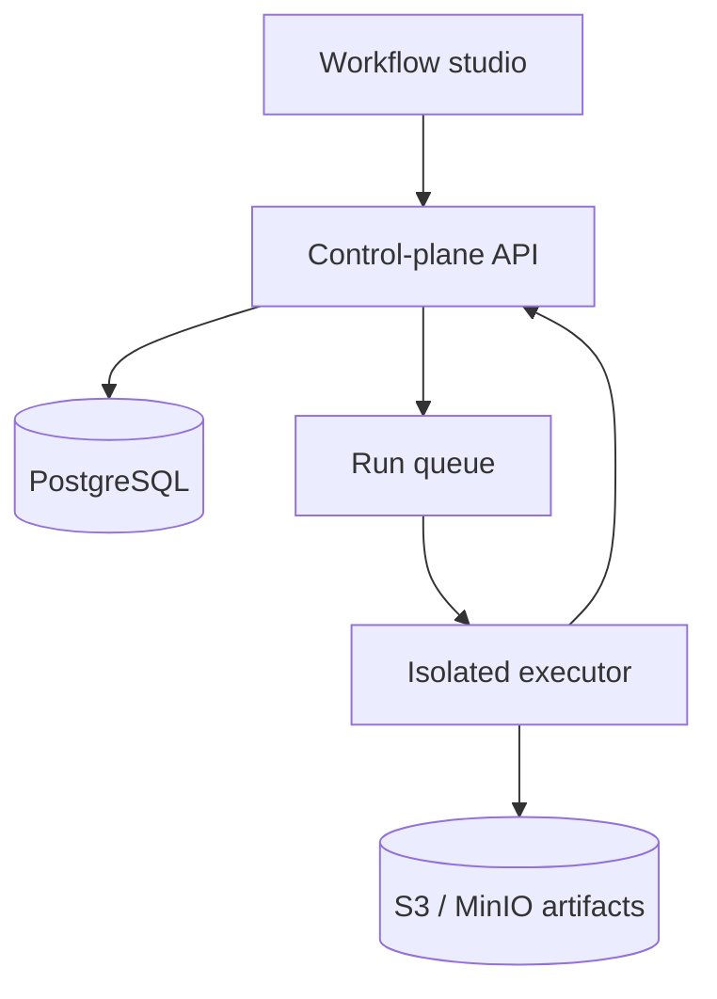
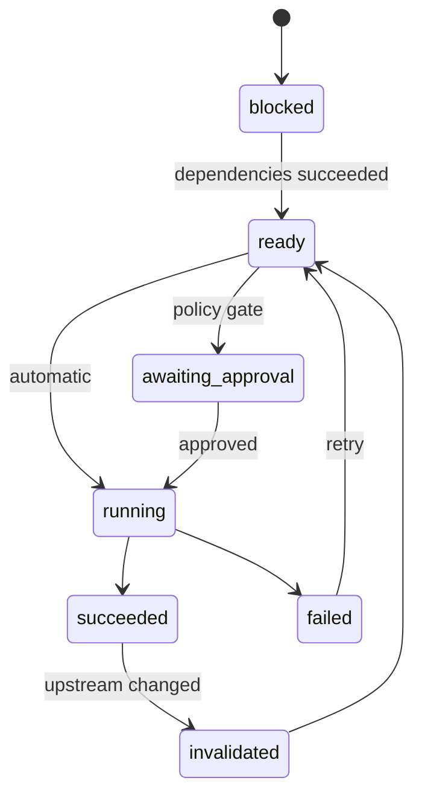

# Architecture

## Two-plane design

The control plane owns intent and state. The execution plane is disposable and untrusted.

## Control plane

- Workflow registry and immutable versions.
- DAG validation and dependency scheduling.
- Agent/tool catalogue and organization policies.
- Run state machine, approvals, events and audit trail.
- Artifact metadata and lineage.
- Secret references; never raw secrets in workflow definitions.

## Execution plane

For the MVP, each executable node runs in a fresh Docker container:

- read-only base image;
- mounted input artifacts, separate writable output directory;
- CPU, memory, process and wall-time limits;
- non-root user and dropped Linux capabilities;
- no host Docker socket;
- network disabled unless an allowlisted tool needs it;
- short-lived credentials scoped to the run and tool;
- output manifest validated before publication.

Docker gives the fastest local development loop. The executor interface must remain generic so a Kubernetes Job executor can replace it without changing workflow contracts.

## Node lifecycle

Terminal failure blocks descendants. Independent branches can continue. An upstream output hash change invalidates only downstream nodes.

## Agent contract

An agent receives an explicit context envelope:

- objective and node instructions;
- input artifact manifests;
- tool schemas and scoped credentials;
- budget and execution policy;
- expected JSON output schema;
- references to approved contextual artifacts.

It returns a result envelope containing status, structured result, artifact manifest, logs summary, metrics, cost/usage, code bundle hash and provenance. Raw conversational state is not an implicit dependency.

## Persistence model

Recommended tables: `projects`, `workflows`, `workflow_versions`, `agent_nodes`, `edges`, `tools`, `tool_versions`, `runs`, `node_runs`, `events`, `artifacts`, `artifact_edges`, `approvals`, `secrets_refs`.

Use append-only run events plus materialized current state. A transactional outbox avoids losing queue messages between database commits and worker dispatch.

## Security gates before real data

1. Static AST checks are useful signals, not the sandbox.
2. Require explicit approval for generated code in the first MVP.
3. Validate file paths and output sizes at the executor boundary.
4. Redact secrets and sensitive columns from logs and model context.
5. Record tool calls and artifact hashes in an immutable audit trail.
6. Treat prompt injection inside datasets as hostile input.

## Technology choices

- Frontend: Next.js, TypeScript, React Flow, TanStack Query.
- API: FastAPI, Pydantic, SQLAlchemy/Alembic.
- Worker: Python, Docker Engine adapter, Polars/Pandas, DuckDB.
- Models: provider-neutral adapter with structured output and streaming events.
- Observability: OpenTelemetry traces keyed by `run_id` and `node_run_id`.

Avoid coupling the domain model to LangGraph, CrewAI or a single provider. Such frameworks can be adapters inside a node, while the platform remains the source of truth for DAG state, artifacts, approvals and audit.

